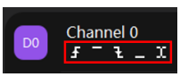
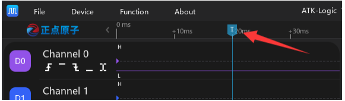
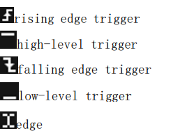
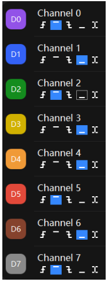

# 🎯 Trigger (Disparo de Captura)

## 📌 Definição
O **trigger** é o mecanismo que define **quando** a captura de dados inicia no analisador lógico.  
Sem trigger, a aquisição ocorreria de forma contínua e desorganizada, dificultando a identificação de eventos de interesse.  
Com ele, podemos capturar **pontos específicos** (bordas, níveis ou combinações lógicas) e analisar o que ocorre **antes e depois** do evento.

---

## 🎚️ Trigger Threshold (Limiar de Disparo)

O **threshold** é a **tensão de referência** usada para distinguir entre `0` e `1` no domínio digital.  
Funciona como o “corte” definido em um comparador:

- Tensões **acima de Vth** → interpretadas como **lógica alta (1)**.  
- Tensões **abaixo de Vth** → interpretadas como **lógica baixa (0)**.  

🔹 Recomenda-se configurar em aproximadamente **50% da amplitude do sinal**:


```
Vth = (Vmax - Vmin) / 2
```


⚠️ Se o threshold for configurado incorretamente, bits podem ser interpretados de forma errada.  

📷 Exemplo do manual (ajuste de threshold):  


---

## 📍 Trigger Position (Posição do Trigger)

A **posição do trigger** define onde o evento será exibido dentro da **janela de captura**.  
Isso permite analisar **o que aconteceu antes** e **o que acontece depois** do evento.

- **Trigger no início** → mostra principalmente os dados **após** o evento.  
- **Trigger no meio (50%)** → divide igualmente antes e depois.  
- **Trigger no final** → prioriza a análise dos dados **anteriores**.  

📷 Exemplo visual (linha azul do trigger na forma de onda):  


📷 Ajuste da posição do trigger no software:  


---

## ⚡ Trigger Condition (Condições de Disparo)

As **condições de trigger** definem o evento exato que dispara a captura.  
O ATK-Logic oferece as seguintes opções:

📷 Ícones usados no software:  


- **Rising edge** → borda de subida  
- **High level** → nível alto  
- **Falling edge** → borda de descida  
- **Low level** → nível baixo  
- **edge** → qualquer transição  

Além disso, é possível combinar condições em **múltiplos canais** usando uma relação **AND lógica**.  
Nesse caso, a captura só ocorre se **todas as condições forem atendidas ao mesmo tempo**.  

📷 Exemplo com múltiplos canais (D0 a D7):  


📷 Exemplo do manual (captura do valor `0x45` em um barramento paralelo de 8 bits):  


---

## 📝 Exemplos Práticos

- **Protocolo UART**  
  Configurar **falling edge** para capturar o **start bit** de cada frame.  

- **Barramento paralelo (8 bits)**  
  Definir condição para capturar somente quando o valor **0x45** estiver presente.  

- **Sinais periódicos**  
  Usar **rising edge** para sincronizar a captura em ciclos específicos.  

---

## 🧩 Resumindo

| Conceito             | O que faz                                                                 | Onde usar                                           |
|-----------------------|---------------------------------------------------------------------------|-----------------------------------------------------|
| **Threshold**         | Define a tensão que separa 0 de 1                                         | Ajustar para 50% da amplitude do sinal              |
| **Position**          | Define o ponto da janela em que o trigger aparece                        | Observar antes e depois do evento                   |
| **Condition**         | Define a condição que dispara a captura                                  | Protocolos seriais, barramentos, sinais periódicos  |
| **Combinação AND**    | Exige que várias condições sejam verdadeiras ao mesmo tempo              | Captura em paralelo (ex.: barramento de 8 bits)     |

---

## 📖 Referências
- ATK-Logic User Manual, seções **5.8 (Trigger Threshold)**, **5.9 (Trigger Position)** e **5.10 (Trigger Condition)**.
