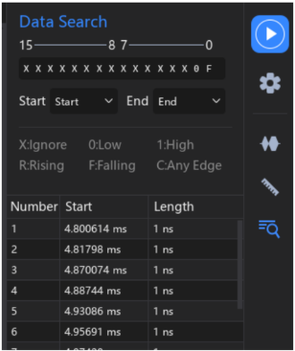

#### 2.013 Data Search

A funcionalidade **Data Search** permite configurar critérios de busca para localizar pontos da forma de onda que atendam a condições específicas dentro dos dados coletados.  
Essa função ajuda a encontrar rapidamente sinais ou eventos de interesse em grandes capturas.

Para abrir a ferramenta de pesquisa, utilize o **menu lateral direito**.  
As condições de busca disponíveis são:

- **Don't Care** → Ignora o estado do canal.
- **Low Level** → Busca quando o sinal está em nível lógico baixo.
- **High Level** → Busca quando o sinal está em nível lógico alto.
- **Rising Edge** → Busca bordas de subida.
- **Falling Edge** → Busca bordas de descida.
- **All Edges** → Busca todas as transições (subida e descida).

Além disso, é possível restringir a busca a uma área específica do tempo, utilizando os marcadores **Start** e **End** como limites de análise.

📌 **Exemplo prático:**  
Se você deseja encontrar todas as formas de onda em que o **Canal 0** apresenta uma borda de descida (**Falling Edge**) e o **Canal 1** está em nível lógico baixo (**Low Level**), a configuração pode ser feita conforme mostrado abaixo.  
Os resultados da pesquisa serão exibidos na janela de resultados.

