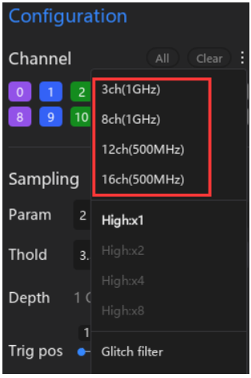
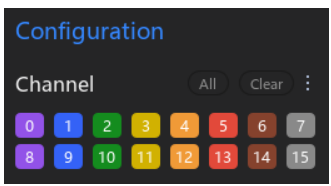

# 2.4 Channel Selection

Os analisadores lógicos geralmente suportam múltiplos canais, mas a taxa máxima de amostragem depende diretamente da quantidade de canais habilitados. O software ATK-Logic permite habilitar ou desabilitar cada canal individualmente, otimizando o uso de recursos conforme a necessidade da medição.

---

## Seleção de Canais
A seleção é feita na aba **Configuration → Channel**, onde os botões correspondem aos canais disponíveis (0 a 15). É possível habilitar/desabilitar manualmente ou usar as opções rápidas **All** (habilita todos) e **Clear** (mantém apenas o canal 0 ativo).

---

## Modos de Canal
O software permite selecionar diferentes configurações de canais que afetam a taxa de amostragem:
- **3 canais @ 1 GHz**
- **8 canais @ 1 GHz**
- **12 canais @ 500 MHz**
- **16 canais @ 500 MHz**

---

## Referência do Manual
No manual, a função de seleção de canais é descrita no capítulo correspondente, incluindo exemplos visuais e explicação sobre as funções rápidas **All** e **Clear**.

---

✅ Essa flexibilidade permite equilibrar profundidade de captura e velocidade de amostragem de acordo com a aplicação prática.
