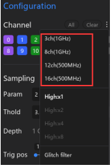

# 2.6 Sampling Frequency

A **Sampling Frequency** (frequência de amostragem) define quantas amostras por segundo o analisador lógico pode coletar de um sinal. Essa configuração é essencial para garantir que a captura represente fielmente o comportamento real do circuito.

---

## Conceito
- Uma frequência de amostragem mais alta gera melhor reprodução de formas de onda, mas também aumenta o volume de dados.
- Frequências de amostragem mais baixas reduzem o volume de dados, porém podem distorcer sinais de alta velocidade.
- Como prática recomendada, a frequência de amostragem deve ser pelo menos **10 vezes maior** que a frequência do sinal a ser medido.

Exemplo: para medir um sinal de **1 MHz**, configure a frequência de amostragem em pelo menos **10 MHz**.

---

## Configuração no Software
A frequência de amostragem pode ser configurada em:  
**Device Configuration → Sampling → Frequency**

---

## Modos de Canal e Frequência Máxima
A frequência máxima depende do número de canais ativos e do modo de operação:
- **3 canais → até 1 GHz**
- **8 canais → até 1 GHz**
- **12 canais → até 500 MHz**
- **16 canais → até 500 MHz**

---

✅ Ajustar corretamente a frequência de amostragem garante medições confiáveis sem desperdício de memória ou perda de detalhes do sinal.
