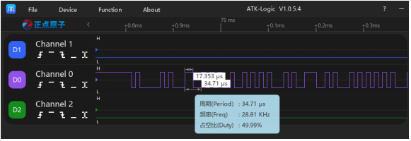
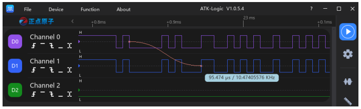
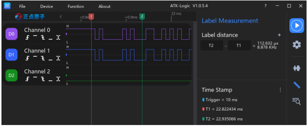
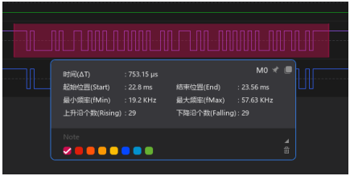

# 2.011 Waveform Measurement

O recurso de **Medição de Formas de Onda** permite analisar parâmetros temporais e de frequência diretamente sobre os sinais capturados, facilitando a interpretação e o diagnóstico. O software ATK-Logic oferece quatro modos principais de medição:

---

## 2.011.1 Mouse Measurement
A função de medição com o **mouse** pode ser ativada/desativada no menu:
```
Settings → General → Mouse Measurement
```
Após a aquisição, basta posicionar o cursor sobre a forma de onda para exibir:
- **Largura do pulso**
- **Período**
- **Frequência**
- **Ciclo de trabalho (duty cycle)**



---

## 2.011.2 Cross-Channel Measurement
Com a medição **entre canais**, após clicar em uma borda de dado, é possível medir:
- O tempo entre a posição inicial e o cursor
- A frequência correspondente

Durante a medição, pode-se dar **zoom in/out** livremente para maior precisão.



---

## 2.011.3 Label Measurement
O recurso de **rótulos de tempo** permite inserir marcadores personalizados. Existem duas formas de adicionar:
1. Duplo clique no eixo de tempo com o botão esquerdo do mouse.  
2. Menu `Label Measurement → Time Labels → More → Add Label`.

Após inserido, o rótulo pode:
- Ser movido livremente ao longo da forma de onda
- Se alinhar automaticamente às transições de borda
- Ser usado para medir tempo entre dois rótulos
- Receber cores e anotações



---

## 2.011.4 Parameter Measurement
A função de **Medição de Parâmetros** fornece dados detalhados como:
- Intervalo de tempo
- Início e fim da medição
- Frequência mínima e máxima
- Contagem de bordas de subida e descida

Inserção pelo menu:
```
Label Measurement → Parameter Measurement → More
```

Suporta também atalhos de teclado, edição de cor, anotações e cópia dos valores.



---

✅ Com esses quatro modos, o ATK-Logic amplia a precisão e a praticidade na análise de sinais digitais.
