# 2.14.1 Adicionar Protocolo

O ATK-Logic permite adicionar protocolos de comunicação para decodificação de sinais seriais, como **UART, I²C, SPI e CAN**. Essa funcionalidade facilita a análise de barramentos digitais em conjunto com as formas de onda coletadas.

---

## Passo a Passo

### 1. Acessar o menu de protocolos
Na barra lateral direita do software, clique em **Protocol Decoding → Protocol**.  
Será exibida a lista de protocolos suportados. Passe o mouse sobre cada um para ver a descrição,  
ou clique no nome para abrir a interface de configuração.


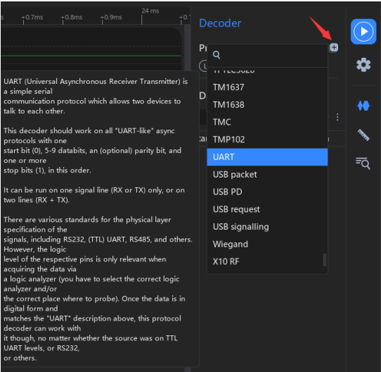

---

### 2. Configuração inicial do protocolo
Selecione o protocolo desejado (ex.: UART, I²C, SPI, CAN) e defina as opções básicas.

Quando selecionamos o protocolo desejado (por exemplo, **UART**), a janela **Protocol Settings** é exibida, permitindo configurar os parâmetros necessários para a decodificação.  
Os campos disponíveis têm a seguinte função:

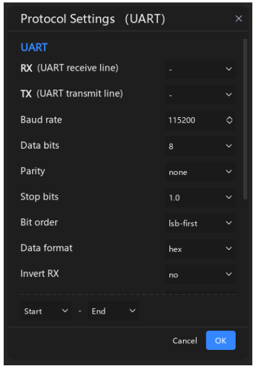

- **RX (UART receive line)** → Canal usado para **receber dados**. Selecione qual canal do analisador lógico está conectado ao pino **RX** do dispositivo.  
- **TX (UART transmit line)** → Canal usado para **transmitir dados**. Selecione o canal conectado ao pino **TX** do dispositivo. Pode ficar em branco se for apenas recepção.  
- **Baud rate** → Taxa de transmissão em **bits por segundo (bps)**. Ex.: 9600, 115200. Deve coincidir com o dispositivo.  
- **Data bits** → Número de bits por palavra de dados. Valores típicos: **7** ou **8**.  
- **Parity** → Método opcional de detecção de erros: **none** (sem paridade), **even** (paridade par), **odd** (paridade ímpar).  
- **Stop bits** → Número de bits de parada após cada palavra. Normalmente **1.0** ou **2.0**.  
- **Bit order** → Ordem dos bits: **lsb-first** (menos significativo primeiro) ou **msb-first** (mais significativo primeiro).  
- **Data format** → Formato de exibição dos dados: **hex**, **bin** ou **ascii**.  
- **Invert RX** → Inverte a polaridade do sinal RX. Útil quando o dispositivo trabalha com lógica invertida.  
- **Start / End** → Define o intervalo da captura onde a decodificação será aplicada.  
- **Botões (Cancel / OK)** →  
  - **Cancel** descarta as alterações.  
  - **OK** confirma as configurações e adiciona o protocolo à lista ativa.  

---

### 3. Decoded Data Display


**Detalhe da tabela de dados:**  
Além da sobreposição direta dos caracteres no sinal (RX/TX data), o ATK-Logic apresenta cada evento em uma lista organizada chamada **Data Interface**.  

Essa tabela exibe:  
- **Start** → instante exato de início do bit ou caractere.  
- **Time** → duração do bit/intervalo.  
- **Type** → se é RX ou TX, e se corresponde a bits ou dados.  
- **Data** → conteúdo interpretado (por exemplo: `Start bit`, `1`, `0`, ou caracteres ASCII).  

🔎 Essa visão detalhada é útil para depuração precisa, pois permite correlacionar o tempo exato de cada bit com a representação lógica e os caracteres recebidos/enviados.

- **Especificar região de decodificação**:  
  Na interface **Protocol Settings**, na parte inferior, é possível definir a região
  de decodificação dos dados configurando os marcadores *Start* e *End*.  
  Isso ajuda a economizar tempo ao limitar a análise apenas ao trecho desejado.
  
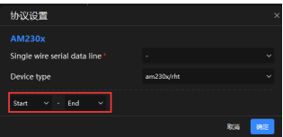
  
  - **Filtragem dos dados na forma de onda**:  
  Clique no botão **Protocol Settings** em **Opções do Canal** (Channel Options).  
  Em **Show**, selecione apenas os dados decodificados que deseja exibir.  
  Isso simplifica a interface da forma de onda, deixando visíveis apenas as
  informações relevantes.


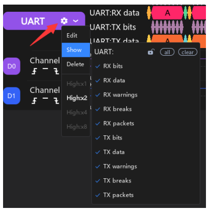

- **Bloqueio da Linha de Protocolo**:  
  Por padrão, as linhas de protocolo se adaptam automaticamente para exibir os
  dados decodificados e, se não houver protocolo na área de forma de onda,
  essas linhas são ocultadas.  
  Porém, ao ativar a opção de **bloqueio da linha**, a posição das linhas de
  protocolo permanece fixa e visível, mesmo quando não há protocolo exibido.  

  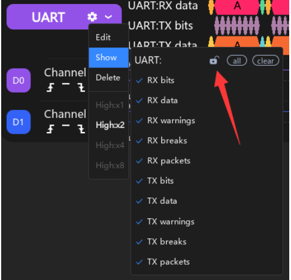

- **Exibição de listas de resultados decodificados**:  
  Ao adicionar múltiplos protocolos simultaneamente (por exemplo, **UART** e **SPI**),
  os dados decodificados podem não aparecer todos na mesma lista.  
  Para simplificar a visualização, é possível escolher quais protocolos exibir indo em:  
  **Protocol Decoding** -> **Data** -> **More**.  

  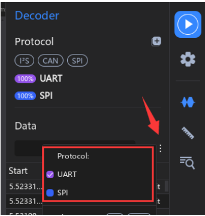

- **Filtragem dos resultados decodificados**:  
  Por padrão, os resultados decodificados são exibidos com todas as informações
  do protocolo selecionado. Para simplificar a lista, é possível escolher quais
  tipos de dados exibir em:  
  **Protocol Decoding** -> **Data** -> **More** -> **Display Rows**.  

  💡 **Dica útil**: ao dar um **duplo clique** em uma linha da lista, o software
  navega rapidamente até o ponto correspondente na forma de onda, facilitando
  a análise.  

  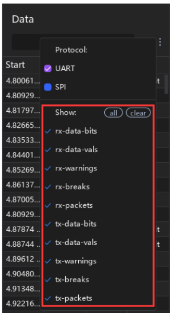

- **Busca nos resultados decodificados**:  
  É possível pesquisar diretamente dentro da lista de resultados decodificados,
  digitando o conteúdo desejado na caixa de busca (**não diferencia maiúsculas
  de minúsculas**).  

  O recurso suporta:  
  - Pesquisa por **tipo** (ex.: RX data, TX data, RX bits).  
  - Pesquisa por **conteúdo da coluna Data** (ex.: "Start bit", "1", "0", caracteres ASCII).  
  - **Sintaxe avançada de busca**, permitindo filtros mais refinados.  

  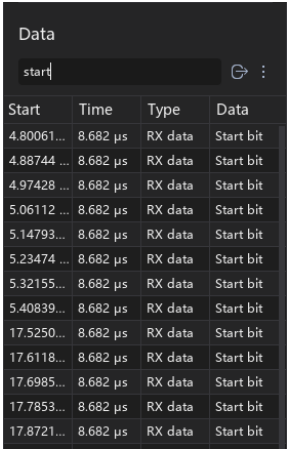

- **Busca avançada com sintaxe**:  
  O ATK-Logic suporta operadores especiais para refinar a pesquisa nos resultados
  decodificados:  

  - **`!!`** → significa *diferente de* (exclui um termo).  
  - **`&&`** → significa *condições paralelas* (combinação de termos).  

  **Exemplo:**  
  Se for necessário buscar dados de texto que contenham `"alientek"` mas **não**
  contenham `"stop"`, a expressão será:  
  ```
  alientek&&!!stop
  ```
  
⚠️ **Observação:** essa pesquisa é **sensível a símbolos e espaços**, portanto
a expressão deve ser escrita exatamente como esperado.

### 4. Tips and Small Features

> **Customizar resultados exibidos na decodificação de protocolos**:  
> Selecione **Protocol Settings** -> **Show** e marque apenas os resultados que deseja exibir.  
> Isso permite esconder informações irrelevantes e manter a interface mais limpa.  


---

> **Filtragem da lista de dados decodificados**:  
> Escolha **Protocol Decoding** -> **Data Filtering** e selecione os tipos de dados que deseja visualizar.  
> Assim é possível focar apenas em pacotes ou valores específicos, ignorando avisos ou bits redundantes.  


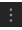

---

> **Exportar dados decodificados**:  
> Selecione **Protocol Decoding** -> **Export Table** para exportar os dados da tabela atual.  
> Esse recurso é útil para documentar testes ou analisar os dados em softwares externos (ex.: Excel).  
> 💡 *Dica: pode ser usado em conjunto com a filtragem, exportando apenas os dados relevantes.*  


---

> **Função “View Following”**:  
> Selecione **Protocol Decoding** -> **View Following**.  
> Ao ativar, a rolagem da interface de visualização é sincronizada com a lista de dados decodificados.  
> Isso garante que waveform e tabela fiquem sempre alinhados, facilitando a análise detalhada.  


---

#### 4.1 Protocol Settings

O **ATK-Logic** suporta mais de **170 protocolos**.  
Para ajudar os usuários a compreender rapidamente os parâmetros de configuração
de cada protocolo, está disponível uma documentação online com detalhes completos:

🔗 **Documentação Online:**  
[ATK-Logic Protocol Documentation](http://www.openedv.com/ATK-Prod/ATK-Logic/docs/index.html)

> ℹ️ Observação: a documentação online será continuamente atualizada, incluindo novos protocolos e ajustes de parâmetros.

---

#### 4.2 Custom Protocol Development

Embora o software suporte mais de **170 decodificadores de protocolos**
comumente utilizados, ainda pode não atender às necessidades específicas de alguns usuários.  
Por esse motivo, disponibilizamos um guia para auxiliar na **adição de novos protocolos personalizados**.

🔗 **Documentação Online para Desenvolvimento Secundário:**  
[Custom Protocol Development Guide](http://www.openedv.com/ATK-Prod/ATK-Logic/docs/index.html)

> ℹ️ Observação: a documentação online é atualizada de forma contínua, garantindo suporte às novas demandas de protocolos.

---

#### 4.3 Protocol Debugging

O **ATK-Logic** fornece uma funcionalidade dedicada para **depuração de protocolos personalizados**.  
Para acessá-la, vá em **Function -> Settings** na barra superior esquerda e selecione **Decoder**.  

O processo de depuração ocorre em três etapas principais:

---

> **Abrir interface de configurações e definir nível de log**  
Altere o campo **Decoder log level** para `Spew`.  
Esse modo mostra mensagens detalhadas, ideais para rastrear problemas de configuração.  

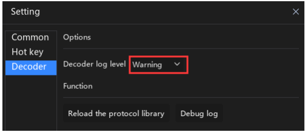

---

> **Abrir a janela Debug Log**  
Clique em **Debug log** para visualizar as mensagens geradas durante a análise.  
Aqui serão exibidos avisos, erros e informações internas do decodificador.  

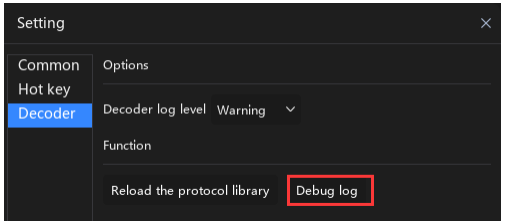

---

> **Recarregar a biblioteca de protocolos**  
Após criar ou modificar um protocolo, clique em **Reload Protocol Library**.  
Em seguida, confira o log para identificar possíveis erros.  

⚠️ *Nota:* se você tiver alterado parâmetros de protocolo, linhas de exibição ou outros conteúdos, pode ser necessário **remover e re-adicionar** o protocolo. A simples reinterpretação nem sempre aplica as mudanças corretamente.  

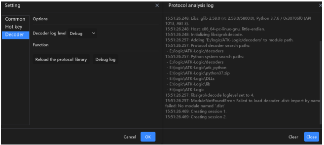

