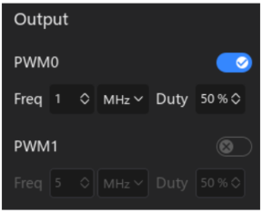

#### 2.014 PWM Output

O analisador lógico também suporta a funcionalidade de **saída de forma de onda (PWM)**.  
Para acessá-la, abra o menu **Device Configuration** na barra lateral direita.  
No canto inferior direito, estará disponível a opção **Waveform Output**.  

⚠️ *Importante:* essa interface só aparece quando o software está conectado a um dispositivo que suporte saída PWM.  
Por padrão, a funcionalidade de PWM vem **desabilitada**.

Abaixo estão mostradas as telas correspondentes:

- **Interface de parâmetros detalhados**:  
Permite configurar frequência, ciclo ativo (duty cycle) e canal de saída.  

- **Status habilitado**:  
Quando a saída PWM está ativa.  

- **Status desabilitado**:  
Quando a saída PWM está desligada.  

