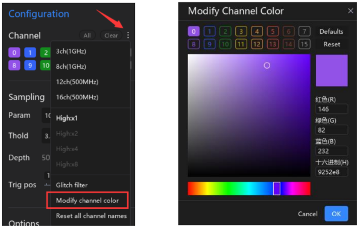

#### 2.015 Channel Color

Por padrão, o **ATK-Logic** define a cor de cada canal de acordo com a cor da linha de conexão correspondente no analisador lógico.  

Se desejar alterar essas cores padrão, é possível abrir a interface de **Channel Color Modification** em:  
**Device Configuration** → **Channel** → **More**.  

Nesta interface, você pode personalizar a cor de cada canal conforme sua preferência, facilitando a identificação visual durante a análise.  

