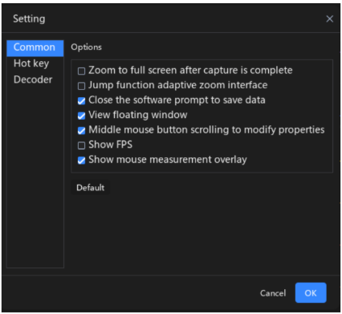

#### 2.016 Habitual Settings

O **ATK-Logic** oferece um conjunto de **configurações habituais** que podem ser personalizadas pelos usuários de acordo com suas preferências.  

Para acessá-las, vá em:  
**Function → Settings → Common** (na barra superior esquerda).  

Nessa interface, é possível ajustar opções frequentemente utilizadas para otimizar o fluxo de trabalho, como parâmetros padrão de captura, modos de visualização e preferências de interface.  

