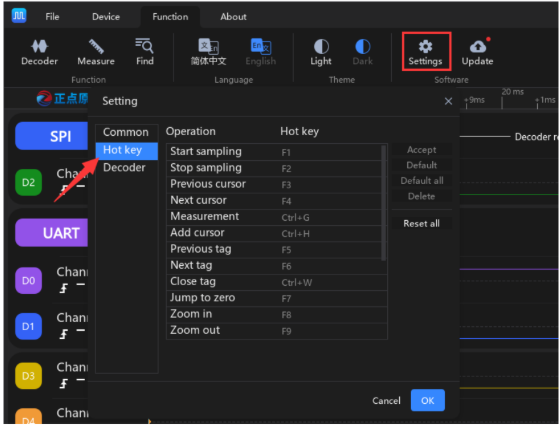

#### 2.017 Hot Key

O **ATK-Logic** disponibiliza diversos **atalhos de teclado** para funções de uso frequente, agilizando a operação do software.  

Além disso, o usuário pode **personalizar** esses atalhos conforme sua preferência.  

Para acessar e configurar os atalhos:  
**Function → Settings → Keyboard Shortcuts** (na barra superior esquerda).  

