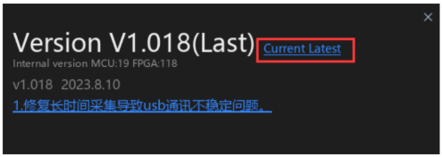
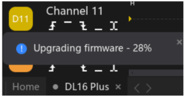

#### 2.018 Firmware Update

O **ATK-Logic** permite realizar a **atualização de firmware** do analisador lógico, garantindo acesso a novas funcionalidades e correções.  

Os passos para atualizar o firmware são os seguintes:

1. **Abrir a interface de atualização**:  
   Vá em **Device → Update** (na barra superior esquerda).  
   - Se aparecer a mensagem *“Latest firmware already installed”*, significa que seu dispositivo já está atualizado.  
   - Caso contrário, você poderá prosseguir com a atualização.  

   

2. **Iniciar a atualização**:  
   Clique em **Update** para iniciar o processo de atualização do firmware do dispositivo.  
   O progresso pode ser acompanhado na barra de status, localizada no canto inferior esquerdo da tela.  

   

⚠️ **Atenção**: Não conecte ou desconecte o dispositivo durante a atualização do firmware, pois isso pode causar falhas no processo.
