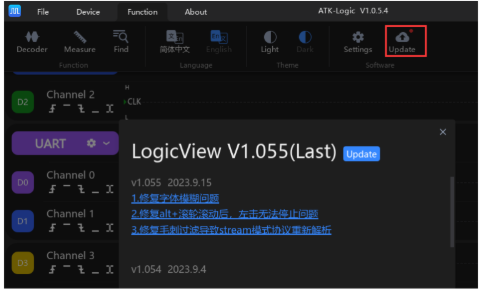

#### 2.019 Software Update

O **ATK-Logic** também disponibiliza a função de **atualização do software**, permitindo que o usuário mantenha a aplicação sempre na versão mais recente.  

Para acessar a atualização:  
**Function → Update** (na barra superior esquerda).  

- Se houver uma nova versão disponível, basta clicar em **Update** para iniciar o processo.  
- Caso apareça a mensagem *“Latest version already installed”*, significa que você já está utilizando a versão mais atual, não sendo necessário atualizar.  

