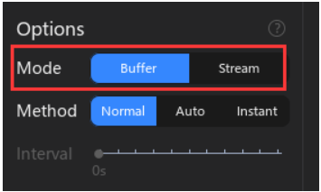

# 2.1 Operating Mode

O **ATK-Logic** suporta **dois modos principais de operação**, configuráveis em:
`Device Configuration -> Options -> Mode`.

---

## 🔹 Buffer Mode

- **Como funciona:**
  - Os dados coletados são primeiro armazenados na **memória interna** do analisador lógico.
  - Após completar toda a profundidade de amostragem definida, os dados são enviados para o computador.

- **Vantagens:**
  - Permite **altíssimas taxas de amostragem**, pois não depende da velocidade do USB.
  - Ideal para sinais rápidos (centenas de MHz a GHz).
  - Suporta **compressão RLE**, aumentando a profundidade efetiva quando o sinal varia pouco.

- **Limitações:**
  - A profundidade de amostragem fica limitada ao **tamanho da memória interna**.
  - Não é ideal para capturas muito longas.

---

## 🔹 Stream Mode

- **Como funciona:**
  - A captura e a transmissão para o computador acontecem **simultaneamente** via USB.
  - Os dados são processados em tempo real pelo software.

- **Vantagens:**
  - Permite capturas **muito longas**, limitadas apenas pela memória do computador.
  - Suporta **decodificação de protocolos em tempo real**.

- **Limitações:**
  - A taxa de amostragem é limitada pela **velocidade do USB**.
  - Não atinge frequências tão altas quanto o modo Buffer.

---

## 📌 Comparação Rápida

| Característica           | Buffer Mode                                  | Stream Mode                      |
|---------------------------|-----------------------------------------------|-----------------------------------|
| Taxa de Amostragem        | Muito alta (até 1 GHz em 8 canais)            | Limitada pelo USB (máx. 100 MHz) |
| Profundidade de Amostragem| Limitada pela memória interna                 | Limitada pela RAM do PC          |
| Compressão RLE            | ✅ Suportada                                  | ❌ Não suportada                  |
| Decodificação em Tempo Real| ❌ Não (apenas pós-captura)                   | ✅ Sim                            |
| Ideal para                | Capturas curtas e sinais de alta frequência   | Capturas longas e análise contínua|

---

## 🎯 Resumindo
- Use **Buffer Mode** quando precisar capturar sinais **muito rápidos** e com **alta precisão**.
- Use **Stream Mode** quando precisar de **longa duração de captura** ou acompanhar sinais em **tempo real**.

---

📖 *Baseado no manual ATK-Logic (Seção 5.1 Operating Mode)*

