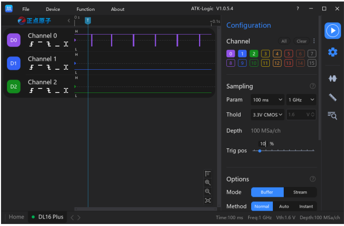

# 2.10 Waveform Viewing

Após a conclusão da coleta de dados, o sinal capturado será exibido na área de visualização do software. Para facilitar a análise, o ATK-Logic oferece várias ferramentas práticas para inspeção das formas de onda.

---

## Operações Disponíveis

- **Waveform Zoom:** Use o scroll do mouse (botão do meio) para ampliar ou reduzir horizontalmente a forma de onda.  
- **Waveform Drag:** Clique e segure o botão esquerdo do mouse para arrastar a forma de onda para a esquerda ou direita.  
- **Scroll Lateral:** Dentro da área de exibição, segure **ALT + scroll** para mover rapidamente para frente ou para trás.  
- **Region Zoom:** Clique e arraste com o botão direito do mouse para selecionar uma região retangular; ao soltar, o zoom será aplicado nessa área.  
- **Channel Scrolling:** Posicione o cursor na área de canais à esquerda e use o scroll (botão do meio) para mover os canais para cima/baixo.  
- **Quick Zoom Framing (atalho Q):** Seleciona uma região e amplia diretamente para essa área.  
- **Quick Zero Crossing Jump:** Clique no ponto de cruzamento de zero para pular diretamente para o evento.  
- **Quickly Zoom to Full Screen (atalho W):** Ajusta automaticamente para visualizar toda a captura na tela.  
- **Quick Zoom Buttons:** Botões dedicados (na parte inferior direita da tela) para zoom in/out.

---

## Ajustes de Canal

- **Channel Height Adjustment:** Arraste o divisor de canais na área lateral para ajustar livremente a altura dos canais. Também é possível usar atalhos pré-definidos (x1, x2, x4, x8) em *Device Configuration → Channel Selection → More*.  
- **Channel Order Adjustment:** Clique e arraste o identificador do canal (ex.: D0, D1) para reorganizar a ordem dos canais conforme necessário.  
- **Channel Name Editing:** Clique no nome do canal para renomeá-lo facilmente.  
- **Collapse Channel Options:** Clique no ícone de colapso (canto superior esquerdo, próximo ao logo Positive Atom) para ocultar/mostrar a lista de canais.

---

## Exemplo de Interface

---

✅ Essas ferramentas tornam a inspeção das formas de onda muito mais eficiente, permitindo analisar eventos específicos em grandes capturas e personalizar a exibição dos canais de acordo com a necessidade do usuário.
