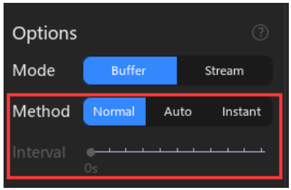
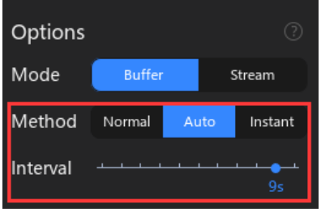
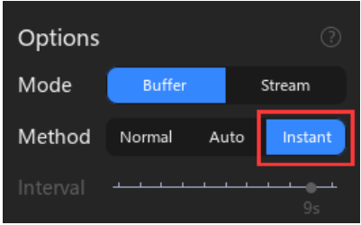
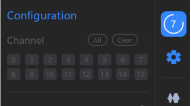

# 2.2 Collection Method

O ATK-Logic suporta três métodos de aquisição de dados: **Normal**, **Auto** e **Instant**. Esses modos podem ser selecionados em:

> `Device Configuration → Options → Method`

---

## 🔹 5.2.1 Normal
No modo Normal, o processo de captura tem diferenças entre **Buffer Mode** e **Stream Mode**.

### Buffer Mode – Etapas do processo
1. **Preparation Phase**: Após clicar em *Start Capture*, o software envia os parâmetros para o analisador lógico.
2. **Start Capture Phase**: O computador envia o comando de captura, iniciando a aquisição de dados.
3. **Pre-Sampling Phase**: O dispositivo coleta dados até atingir a profundidade de pré-amostragem (definida pela posição do trigger × profundidade total).
4. **Waiting for Trigger Phase**: Se houver trigger configurado, o dispositivo continua a coletar até que a condição seja satisfeita. Caso contrário, essa fase é ignorada.
5. **Waiting for Capture Completion**: A captura termina quando o tempo ou a memória do buffer são atingidos.
6. **Waveform Rendering Phase**: Os dados são transferidos para o software, que renderiza as formas de onda.

### Stream Mode – Etapas do processo
1. **Preparation Phase**: O software envia os parâmetros.
2. **Start Capture Phase**: O computador envia o comando de captura.
3. **Pre-Sampling Phase**: O dispositivo coleta dados até atingir a profundidade de pré-amostragem (fixa neste modo).
4. **Waiting for Trigger Phase**: Caso haja trigger, a captura continua até que a condição seja satisfeita.
5. **Sampling Phase**: Durante a aquisição, os dados são enviados em tempo real ao software, que exibe as formas de onda ao vivo. O processo termina quando o tempo de captura é atingido.

✅ **Uso típico**: análise de eventos específicos (Normal) ou observação contínua em tempo real (Stream).

---

## 🔹 5.2.2 Auto (Cíclico)

- Repete automaticamente o processo do modo Normal.
- Exibe um **contador regressivo** na barra de progresso.
- Permite configurar o **Sampling Interval** (intervalo entre capturas).

✅ **Uso típico**: monitoramento repetitivo, útil para detectar falhas ou eventos intermitentes.

---

## 🔹 5.2.3 Instant

- Funciona de forma idêntica ao modo Normal, **mas ignora o trigger**.
- Captura imediata, sem esperar condição específica.

✅ **Uso típico**: verificação rápida de sinais sem necessidade de configuração de trigger.

---

## 📊 Comparação entre métodos

| Método   | Trigger | Repetição | Característica principal |
|----------|---------|-----------|--------------------------|
| Normal   | ✅ Sim  | ❌ Não    | Captura controlada por trigger, detalhada |
| Auto     | ✅ Sim  | ✅ Sim    | Captura cíclica, repete automaticamente |
| Instant  | ❌ Não  | ❌ Não    | Captura imediata, sem trigger |

---

📌 Esses três métodos fornecem flexibilidade para diagnósticos rápidos, monitoramento contínuo ou análises detalhadas.

---

## 🔧 Configuração de Canais

Antes de iniciar qualquer captura, é possível selecionar os canais ativos no menu de configuração.

✅ **Uso típico**: ativar apenas os canais de interesse para reduzir dados processados e otimizar a análise.
