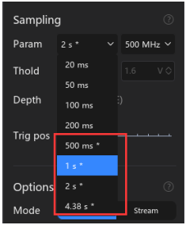

# 2.3 Data Compression

O ATK-Logic DL16 utiliza o algoritmo **RLE (Run-Length Encoding)** para compressão de dados. Esse método substitui sequências repetidas de dados por um *token* e o número de repetições, reduzindo significativamente o tamanho das informações armazenadas.

---

## 🔹 Como funciona o RLE
- Exemplo: a sequência `AAAAABBBCCD` pode ser comprimida em `5A3B2C1D`.
- Isso significa: `5A` → cinco ocorrências consecutivas de A, `3B` → três de B, e assim por diante.
- É um método **lossless** (sem perda de informação).

---

## 🔹 Condições de uso
- Disponível **somente no Buffer Mode**.
- Mais eficiente quando o sinal analisado varia **lentamente ou de forma intermitente**.
- Se o sinal varia rapidamente e de forma contínua, a eficiência da compressão pode ser reduzida.

---

## 🔹 Configuração no software
Para habilitar a compressão, basta escolher um valor de **Sampling Time** que contenha o asterisco `*`.  
Parâmetros sem o asterisco significam que a compressão **não está ativada**.

📌 **Sugestão de inserção da imagem extra**: use-a logo abaixo desta seção, como reforço visual, porque o print mostra a tela do manual explicando a compressão com *Sampling Time* e o aviso em vermelho. Isso torna a explicação mais clara para o leitor.

---

## ⚠️ Observação importante
Se você escolher um *Sampling Time* com `*`, o tempo real de amostragem dependerá da quantidade de variação do sinal testado.  
Ou seja, pode não atingir exatamente o valor configurado no menu — isso é um comportamento esperado e normal.

> Exemplo: Selecione `1 s*` → o tempo real pode ser menor ou maior, dependendo da estabilidade do sinal.

---

✅ **Uso típico**: economizar memória e ampliar a profundidade de captura em sinais pouco variáveis.
