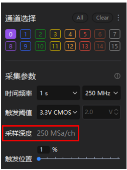

# 2.7 Sampling Depth

A **Sampling Depth** (profundidade de amostragem) representa a quantidade de dados que o analisador lógico pode armazenar na memória durante a captura. Quanto maior a profundidade, mais informações sobre a forma de onda podem ser registradas para análise posterior.

---

## Conceito
A profundidade de amostragem é determinada por três fatores principais:
- **Tempo de amostragem (time)**
- **Frequência de amostragem (frequency)**
- **Número de canais ativos (channels)**

A fórmula geral é:

```
Depth (bits) = Time (s) × Frequency (Hz) × Canais (ch)
```

Exemplo: com **250 MHz × 1 s × 1 canal**, temos **250 MSa/ch** (250 milhões de amostras por canal).

---

## Configuração no Software
No ATK-Logic DL16, a profundidade de amostragem é configurada em:  
**Device Configuration → Sampling → Depth**



---

## Observações
- Profundidade maior = mais dados, porém maior consumo de memória.
- A profundidade é ajustada automaticamente pelo software de acordo com os parâmetros definidos.
- Ao reduzir o número de canais, é possível aumentar a profundidade de amostragem disponível por canal.

---

✅ Ajustar corretamente a profundidade garante equilíbrio entre **tempo de captura** e **resolução dos sinais** analisados.
