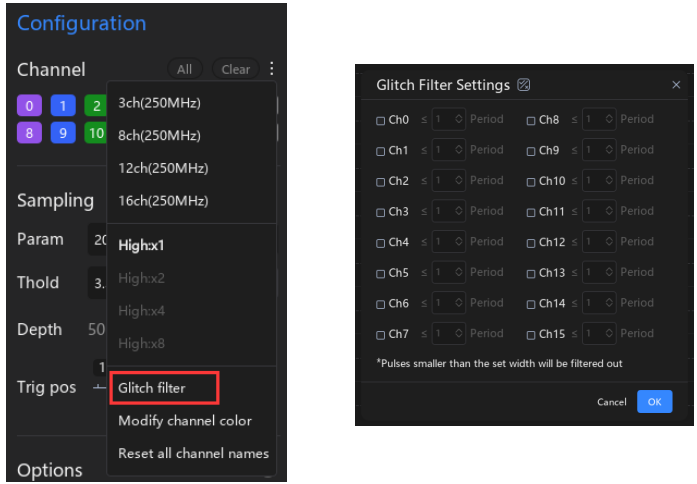

# 2.9 Glitch Filter

O filtro de glitch do ATK-Logic permite eliminar pulsos muito curtos (*spikes*) que podem ser interpretados como sinais válidos, mas na prática são apenas ruídos. Essa função é especialmente útil para melhorar a confiabilidade da análise.

---

## Como Ativar
O recurso pode ser acessado em:

> `Device Configuration → Channel → More → Glitch Filtering Settings`

No menu exibido, é possível selecionar os canais desejados e definir o período mínimo do pulso. Qualquer pulso mais curto que o valor configurado será automaticamente filtrado.

---

## Funcionamento
- Cada canal pode ter o filtro configurado individualmente.  
- O período de filtragem é baseado no **período de amostragem**.  
- Pulsos menores que o limite definido não serão exibidos na forma de onda.  

---

## Exemplo de Interface

---

✅ Esse recurso é essencial quando há ruídos de alta frequência ou sinais espúrios que poderiam prejudicar a análise do sinal principal.
