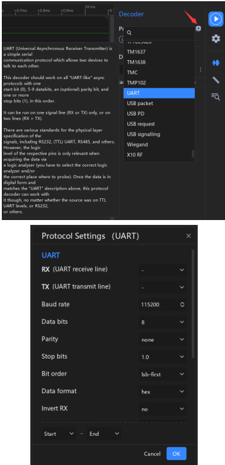
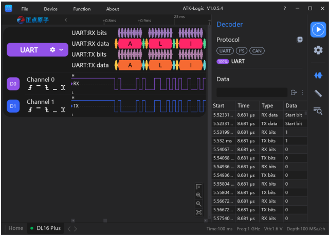

# 2.14.1 Adicionar Protocolo

O ATK-Logic permite adicionar protocolos de comunicação para decodificação de sinais seriais, como **UART, I²C, SPI e CAN**. Essa funcionalidade facilita a análise de barramentos digitais em conjunto com as formas de onda coletadas.

---

## Passo a Passo

### 1. Acessar o menu de protocolos
No software, abra o menu de protocolos para iniciar a adição.

---

### 2. Configuração inicial do protocolo
Selecione o protocolo desejado (ex.: UART, I²C, SPI, CAN) e defina as opções básicas.

---

### 3. Mapeamento de canais
Associe os sinais do protocolo (ex.: SDA/SCL, MOSI/MISO/CLK, RX/TX) aos canais do analisador lógico.

---

### 4. Ajuste de parâmetros
Defina parâmetros como baud rate, polaridade de clock, modo de amostragem, entre outros.

---

### 5. Resultados da decodificação
Os dados decodificados serão exibidos em tabela junto às formas de onda, permitindo correlacionar bits e bytes com o sinal capturado.

---

### 6. Seleção de região
É possível aplicar a decodificação apenas em uma parte da captura, delimitando regiões específicas.

---

### 7. Opções de filtragem
Filtre eventos ou dados para visualizar apenas informações relevantes durante a análise.

---

### 8. Fixar linha do protocolo
Bloqueie a linha de protocolo para mantê-la visível em múltiplos canais.

---

### 9. Exibir múltiplos protocolos
O software permite sobrepor e exibir simultaneamente diferentes protocolos.

---

## Benefícios
- **Análise rápida** de protocolos seriais comuns.  
- **Flexibilidade** com filtros e seleção de regiões.  
- **Comparação** de múltiplos protocolos em uma mesma captura.  

✅ Essa funcionalidade é essencial para depuração de sistemas embarcados e análise de comunicação digital.
