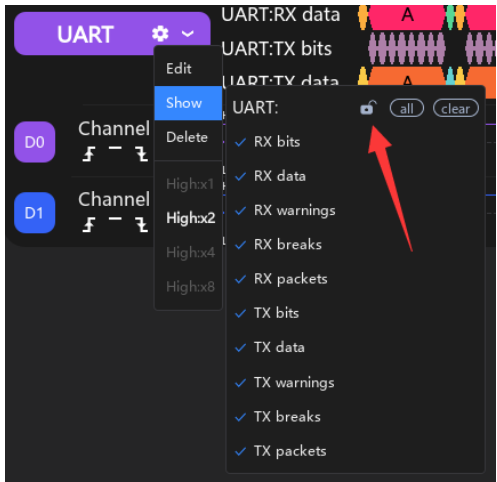
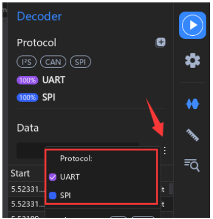
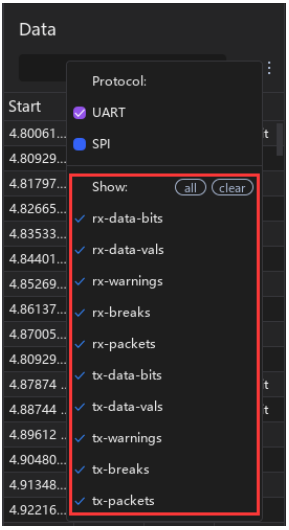
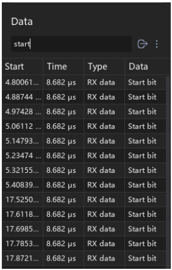

# 2.14.1 Adicionar Protocolo

O ATK-Logic permite adicionar protocolos de comunicação para decodificação de sinais seriais, como **UART, I²C, SPI e CAN**. Essa funcionalidade facilita a análise de barramentos digitais em conjunto com as formas de onda coletadas.

---

## Passo a Passo

### 1. Acessar o menu de protocolos
Na barra lateral direita do software, clique em **Protocol Decoding → Protocol**.  
Será exibida a lista de protocolos suportados. Passe o mouse sobre cada um para ver a descrição,  
ou clique no nome para abrir a interface de configuração.

---

### 2. Configuração inicial do protocolo
Selecione o protocolo desejado (ex.: UART, I²C, SPI, CAN) e defina as opções básicas.

Quando selecionamos o protocolo desejado (por exemplo, **UART**), a janela **Protocol Settings** é exibida, permitindo configurar os parâmetros necessários para a decodificação.  
Os campos disponíveis têm a seguinte função:

- **RX (UART receive line)** → Canal usado para **receber dados**. Selecione qual canal do analisador lógico está conectado ao pino **RX** do dispositivo.  
- **TX (UART transmit line)** → Canal usado para **transmitir dados**. Selecione o canal conectado ao pino **TX** do dispositivo. Pode ficar em branco se for apenas recepção.  
- **Baud rate** → Taxa de transmissão em **bits por segundo (bps)**. Ex.: 9600, 115200. Deve coincidir com o dispositivo.  
- **Data bits** → Número de bits por palavra de dados. Valores típicos: **7** ou **8**.  
- **Parity** → Método opcional de detecção de erros: **none** (sem paridade), **even** (paridade par), **odd** (paridade ímpar).  
- **Stop bits** → Número de bits de parada após cada palavra. Normalmente **1.0** ou **2.0**.  
- **Bit order** → Ordem dos bits: **lsb-first** (menos significativo primeiro) ou **msb-first** (mais significativo primeiro).  
- **Data format** → Formato de exibição dos dados: **hex**, **bin** ou **ascii**.  
- **Invert RX** → Inverte a polaridade do sinal RX. Útil quando o dispositivo trabalha com lógica invertida.  
- **Start / End** → Define o intervalo da captura onde a decodificação será aplicada.  
- **Botões (Cancel / OK)** →  
  - **Cancel** descarta as alterações.  
  - **OK** confirma as configurações e adiciona o protocolo à lista ativa.  

---

### 3. Mapeamento de canais
Associe os sinais do protocolo (ex.: SDA/SCL, MOSI/MISO/CLK, RX/TX) aos canais do analisador lógico.

---

### 4. Ajuste de parâmetros
Defina parâmetros como baud rate, polaridade de clock, modo de amostragem, entre outros.

---

### 5. Resultados da decodificação
Os dados decodificados serão exibidos em tabela junto às formas de onda, permitindo correlacionar bits e bytes com o sinal capturado.

---

### 6. Seleção de região
É possível aplicar a decodificação apenas em uma parte da captura, delimitando regiões específicas.

---

### 7. Opções de filtragem
Filtre eventos ou dados para visualizar apenas informações relevantes durante a análise.

---

### 8. Fixar linha do protocolo
Bloqueie a linha de protocolo para mantê-la visível em múltiplos canais.

---

### 9. Exibir múltiplos protocolos
O software permite sobrepor e exibir simultaneamente diferentes protocolos.

---

## Benefícios
- **Análise rápida** de protocolos seriais comuns.  
- **Flexibilidade** com filtros e seleção de regiões.  
- **Comparação** de múltiplos protocolos em uma mesma captura.  

✅ Essa funcionalidade é essencial para depuração de sistemas embarcados e análise de comunicação digital.
